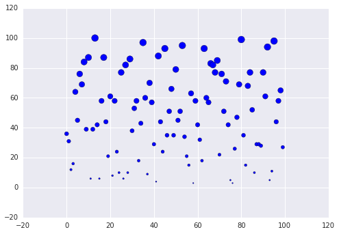
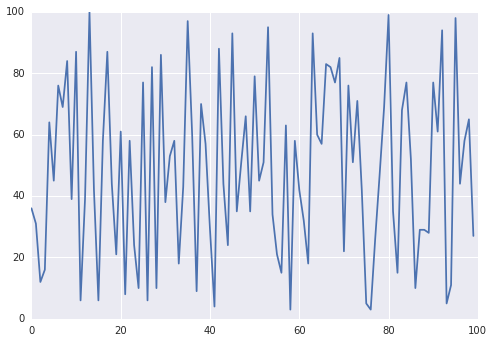

    %matplotlib inline
    from numpy import random
    import matplotlib.pyplot as plt
    import seaborn as sns

    z = random.random_integers(1,100,100) #200 elements, normal dist with mean = 15, sd = 2

    plt.scatter(range(100), z, z)

    <matplotlib.collections.PathCollection at 0x12353518>

    plt.plot(z)

    [<matplotlib.lines.Line2D at 0x127a3160>]

